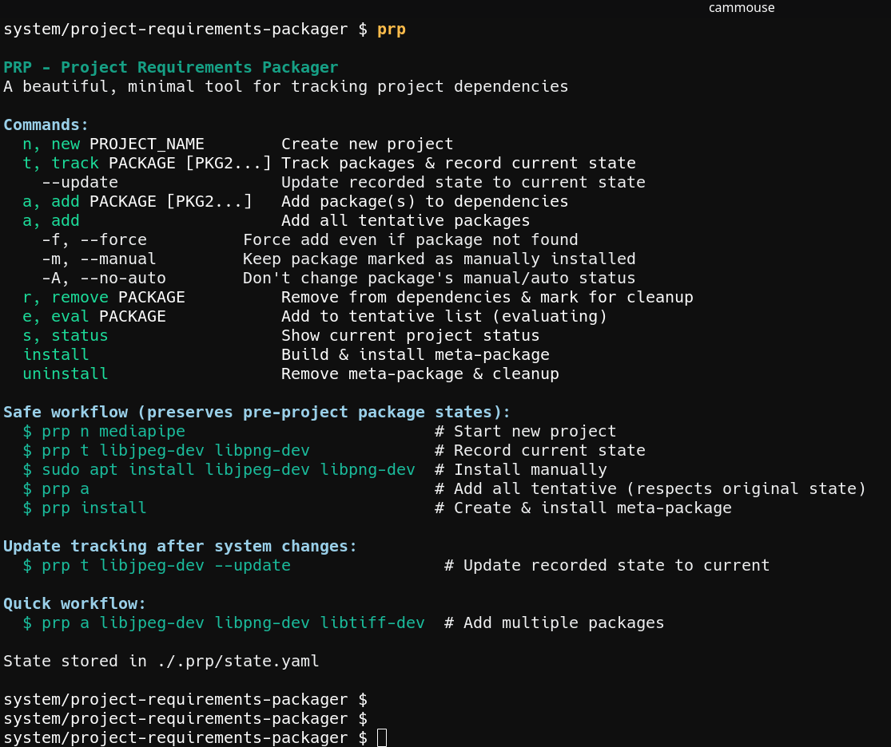

# PRP (Project Requirements Packager)

> *Finally, a tool that remembers what you installed so you don't have to remember why you installed it.*

**PRP** is a beautiful, minimal tool that tracks your project's build dependencies and creates clean meta-packages for Debian/Ubuntu systems. It's the missing piece between "just `apt install` whatever" and "wait, what did I install for this project again?"

<div align="center">
  <em>Usage overview</em><br>
  <br>
</div>

## The Problem

You know the drill:
```bash
$ make
/usr/bin/ld: cannot find -ljpeg: No such file or directory
$ sudo apt install libjpeg-dev
$ make  
/usr/bin/ld: cannot find -lpng: No such file or directory
$ sudo apt install libpng-dev
$ make
/usr/bin/ld: cannot find -ltiff: No such file or directory
# ... 20 minutes later ...
$ make
✓ Success! 
# ... 6 months later ...
$ sudo apt autoremove
# Did I need those 47 -dev packages? 🤷
```

**PRP** turns this chaos into clean, tracked, removable dependency management.

## Quick Start

```bash
# Download and make executable
curl -O https://raw.githubusercontent.com/yourusername/prp/main/prp
chmod +x prp

# Create a project and track dependencies (auto-installs!)
## This creates the .prp dir local to the current working directory. The project name is used for later packaging up as `my-cool-project-deps.deb` that depends on the dependencies.
./prp n my-cool-project
./prp t libjpeg-dev libpng-dev libtiff-dev

# Add to project dependencies (respects pre-existing package states)
./prp a

# Create meta-package and install
./prp install

# Later: clean removal
./prp uninstall
sudo apt autoremove  # Now safe and predictable
```

## Features That Actually Matter

### 🛡️ **Non-Destructive by Design**
PRP remembers what was manually installed *before* your project started. Your colleague's `libjpeg-dev` won't become auto-removable just because you used it too.

### ⚡ **Track & Install in One Command**
```bash
prp t libjpeg-dev libpng-dev libtiff-dev  # Records state AND installs
# No more manual `sudo apt install` step!
```

### 📦 **One Command, Multiple Packages**
```bash
prp a libjpeg-dev libpng-dev libtiff-dev libavcodec-dev libavformat-dev
# Because copying from Stack Overflow should be this easy
```

### 🎯 **Tentative Tracking**
```bash
prp t opencv-dev qt5-dev  # "I might need these..." (auto-installs)
# (experiment for 3 hours)
prp a                     # "OK, keeping them all"
```

### 🧹 **Clean Meta-Packages**
Creates proper Debian packages that `apt` understands. No weird scripts, no magic files in `/usr/local/`, no "trust me bro" installations.

### 🔄 **Smart State Management**
- **Track** packages and auto-install while preserving original states
- **Add** packages individually or in bulk with intelligent auto-marking
- **Remove** cleanly with restoration to pre-project configuration

## Commands Reference

| Command | What it does | Why you'll love it |
|---------|-------------|-------------------|
| `prp n PROJECT` | Create new project (makes .prp/ dir; PROJECT-deps is the future package name) | Because naming things is hard enough
| `prp t PKG [PKG2...]` | Track packages & auto-install | One command to rule them all |
| `prp t PKG -I` | Track only (no install) | For the control freaks |
| `prp a PKG [PKG2...]` | Add packages to dependencies | The meat and potatoes |
| `prp a` | Add all tentative packages | For the "yep, all of them" moment |
| `prp e PKG` | Add to tentative (evaluating) | "I think I need this but..." |
| `prp r PKG` | Remove from deps & mark for cleanup | Mistakes were made |
| `prp s` | Show status | Your project at a glance |
| `prp install` | Build & install meta-package | Make it official |
| `prp uninstall` | Remove meta-package & cleanup | The great cleanup |

### Track Command Options

| Flag | Effect | Use Case |
|------|--------|----------|
| `prp t PKG` | Track & install (default) | Normal workflow |
| `prp t PKG -I` | Track only, don't install | Manual control over installation |
| `prp t PKG --no-install` | Same as `-I` | Explicit clarity |
| `prp t PKG --update` | Refresh recorded state | After manual system changes |

## Real-World Workflows

### The Streamlined Workflow (Recommended)
*The new default - track and install in one step*

```bash
prp n mediapipe-experiment
prp t libjpeg-dev libpng-dev libtiff-dev opencv-dev  # Auto-installs!
prp a  # Adds all tentative, respects pre-project states
prp install
```

### The Control Freak Workflow
*For when you want manual control*

```bash
prp n mediapipe-experiment
prp t libjpeg-dev libpng-dev -I  # Track but don't install
sudo apt install libjpeg-dev    # Install manually when ready
sudo apt install libpng-dev
prp a  # Add all tentative
prp install
```

### The YOLO Workflow  
*For when you're feeling lucky*

```bash
prp n quick-hack
prp a libjpeg-dev libpng-dev libtiff-dev  # Direct add & install
prp install
```

### The "Oh No" Workflow
*For when things went sideways*

```bash
prp r opencv-dev  # Oops, didn't need this
prp uninstall     # Nuclear option: remove everything
sudo apt autoremove  # Now safe
```

### The Incremental Workflow
*Building up dependencies as you discover them*

```bash
prp n complex-project
prp t libjpeg-dev      # Start with what you know
# (build fails)
prp t libpng-dev       # Add more as needed
# (build fails again)  
prp t libtiff-dev      # Keep adding...
prp a                  # Finalize all tentative
prp install
```

## Installation

### Requirements
- Python 3.6+ 
- `equivs` package (`sudo apt install equivs`)
- `python3-yaml` (`sudo apt install python3-yaml`)

### Install PRP
```bash
# Method 1: Direct download
curl -O https://raw.githubusercontent.com/yourusername/prp/main/prp
chmod +x prp
sudo mv prp /usr/local/bin/

# Method 2: Clone and symlink
git clone https://github.com/yourusername/prp.git
sudo ln -s $(pwd)/prp/prp /usr/local/bin/prp
```

## FAQ

**Q: Yet another package manager?**  
A: No. PRP is a *dependency tracker* that creates standard Debian packages. It's `equivs` with a brain and a memory.

**Q: Why does `prp t` install packages automatically now?**  
A: Because 90% of the time, you track packages because you're about to install them. Use `-I` when you want to track without installing.

**Q: What about Docker/containers?**  
A: Great for production. This is for development where you need to `apt install` things while figuring out what you actually need.

**Q: Does it work on RPM systems?**  
A: Not yet. PRs welcome for the brave souls who want to implement `zypper`/`dnf` support.

**Q: My company has security policies about meta-packages...**  
A: PRP generates standard Debian control files that your security team can audit. The generated `.deb` files are just dependency lists—no code execution.

**Q: What if I already have a mess of manually installed packages?**  
A: `prp t package1 package2 --update` will record current states. PRP is designed to be adopted gradually.

**Q: Can I track packages that aren't in the main repos?**  
A: Yes! Use `prp a package-name -f` to force-add packages from PPAs or custom repos. `prp t` will skip installation for packages it can't find but still track them.

## Under the Hood

PRP stores project state in `.prp/state.yaml`:

```yaml
project:
  name: my-project
  package_name: my-project-deps # This becomes the .deb filename
dependencies:
  - libjpeg-dev
  - libpng-dev
tentative:
  - opencv-dev
original_state:
  libjpeg-dev:
    was_installed: true
    was_manual: true  # Won't mark as auto on cleanup
  libpng-dev:
    was_installed: false
    was_manual: false  # Was installed by this project
```

The generated meta-package is just a standard Debian package that depends on your tracked packages. No magic, no lock-in.

When you `prp t package-name`, PRP:
1. Records the package's current state (installed/not installed, manual/auto)
2. Installs the package via `sudo apt install -y` (unless `-I` flag used)
3. Adds to tentative list for later confirmation with `prp a`

## Contributing

Found a bug? Have a feature idea? The codebase is refreshingly simple:

- `core/` - Project state management
- `platform/` - Debian/Ubuntu integration  
- `hooks/` - Extension points (future)

See [CONTRIBUTING.md](CONTRIBUTING.md) for guidelines.

## License

MIT License. Because dependency management pain should be freely shared.

---

*PRP: For developers who've learned that "I'll remember what I installed" is the first lie we tell ourselves.*
